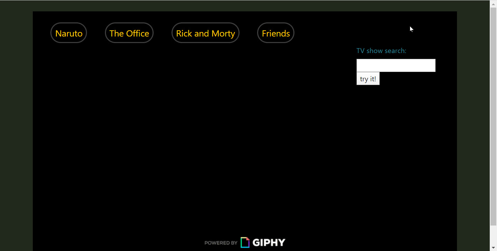
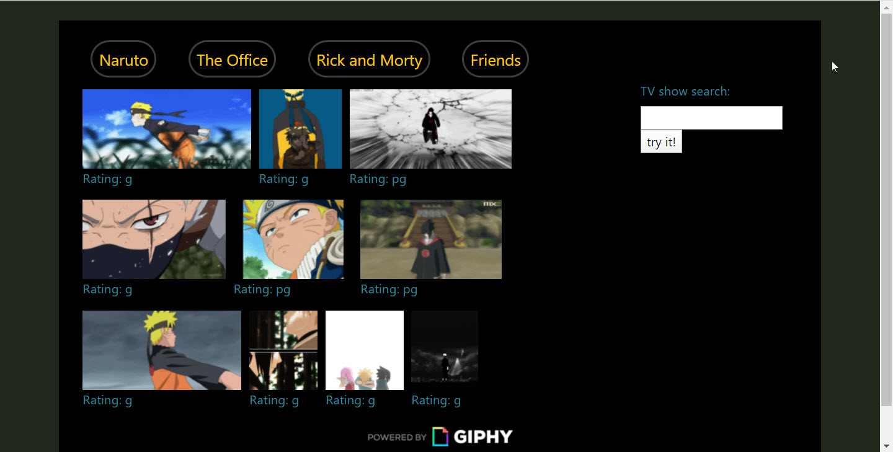
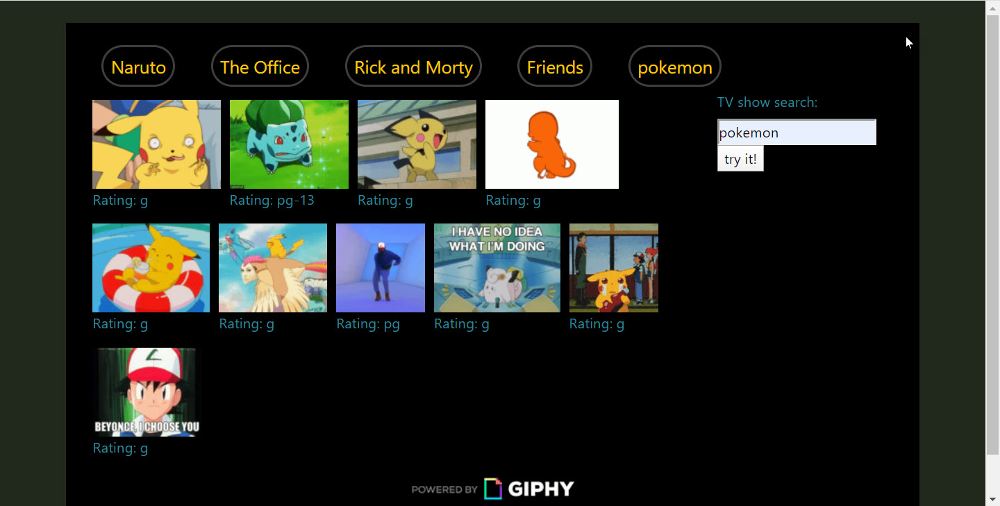

# AJAX-and-GIPHY

Utilizes the API GIPHY to generate a search for 10 gifs.  

============================================================
## Components:
-button functions that make individual AJAX calls
-on click, images switch from still, to animated state
-form: allows user to input their own search

============================================================
## Extra features:
-hovering techniques
-working with Bootstrap styles for responsive visual behavior (flexwrap)

============================================================
## link to deployed project: 
https://kellikells.github.io/AJAX-and-GIPHY/

============================================================
### Screenshots of the app's functions:

# Initial page load:

# Clicking an existing link:

# User input added to clickable links:

